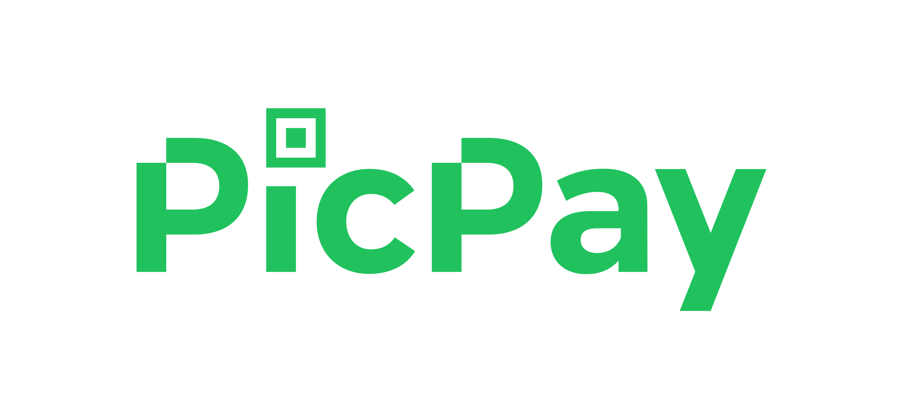

# PicPay-Clone

<h1 align="center">

</h1>

### :page_with_curl: About
This project is a clone of the PicPay application made in React Native.

### :rocket: How to install and start 
- `git clone https://github.com/jonabf1/PicPay-Clone`
- **Go to repository folder**
- `yarn start` (install all dependencies)
- `react native run/android` (build in app for Android or IOS emulator)
- `react native start` (start the application service)

### :heavy_check_mark: Mobile

  
  
  
  
  

---

Made with ♥ by <a href="https://www.linkedin.com/in/jonathan-barros-franco">Jonathan</a>

